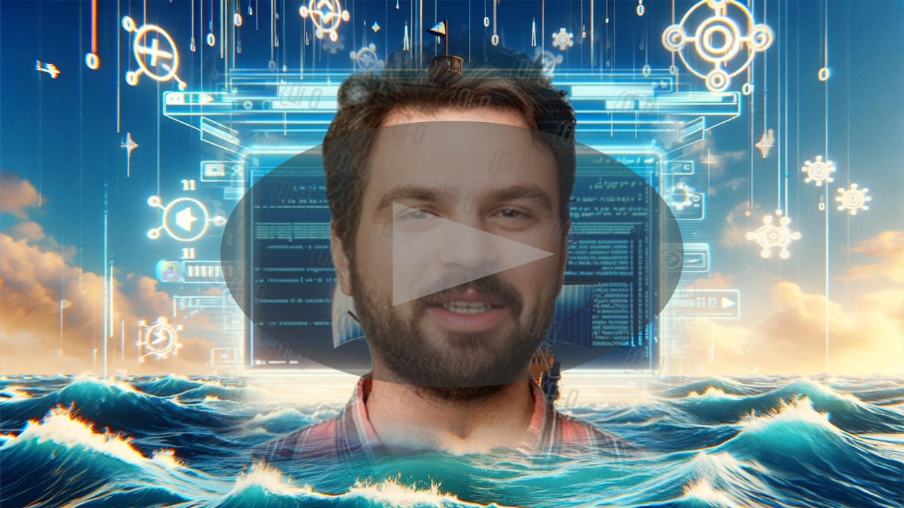

# Vídeo: Ética e IAs Generativas - Análise dos dilemas éticos em torno do uso de Inteligências Artificiais

    

## 📒 Descrição
Neste vídeo rápido e envolvente, exploramos os dilemas éticos associados ao uso de inteligências artificiais generativas. Discutimos como essas tecnologias, que podem criar conteúdos impressionantes a partir de informações existentes, levantam questões importantes sobre autoria, originalidade e responsabilidade. Através de exemplos simples e uma linguagem acessível, abordamos os desafios e as implicações éticas dessas ferramentas poderosas.

## 🤖 Tecnologias Utilizadas
Utilizamos diversas IAs generativas para ilustrar os conceitos discutidos no vídeo:
- IA Generativa **[ChatGPT](https://chat.openai.com)** para roteirização e revisão;
- IA Generativa **[Dall-e](https://openai.com/index/dall-e-2)** para gerar imagem de background;
- IA Generativa **[D-ID](https://www.d-id.com)** para sintetização de voz e geração de avatar virtual;
- Software **[Filmora](https://filmora.wondershare.com.br/)** para edição de vídeo;
- Software **[Power Point](https://www.microsoft.com/en/microsoft-365/powerpoint)** para criação da capa.

## 🧐 Processo de Criação
Para a elaboração deste vídeo, recorri ao ChatGPT para auxiliar na escrita e revisão do roteiro, garantindo que o conteúdo fosse informativo e envolvente. Utilizei também a tecnologia D-ID para criar um avatar digital animado e uma voz sintetizada, adicionando um toque de modernidade e inovação à apresentação. A edição final do vídeo foi realizada no Filmora, uma escolha que proporcionou um maior acabamento.

## 🚀 Resultados
O vídeo resultou em um material visualmente atraente e altamente informativo, destacando eficazmente o potencial das IAs Generativas como ferramentas educacionais.

## 💭 Reflexão (Opcional)
Criar conteúdo informativo e educativo utilizando IA apresentou desafios únicos, especialmente ao tentar equilibrar precisão técnica e acessibilidade. Foi crucial evitar jargões complexos para manter o vídeo interessante e compreensível para fãs de tecnologia e admiradores de "One Piece". O processo foi uma oportunidade valiosa de explorar como a tecnologia pode ser usada para engajar e educar de maneira criativa e ética.

## 👨‍💻 Desenvolvedor

    
      

        
&nbsp&nbspYuri Dias 
        &nbsp&nbsp&nbsp
    

 

     
